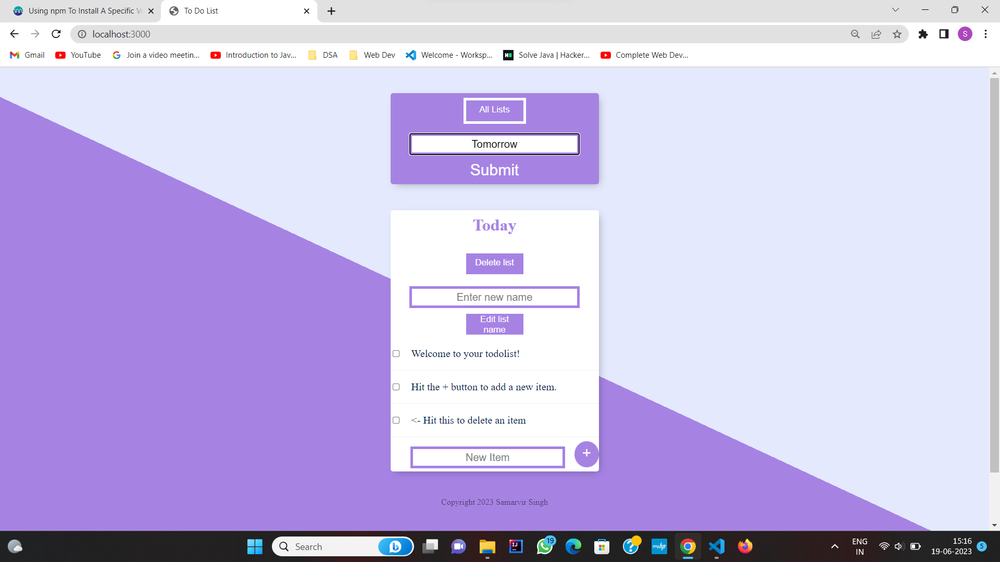
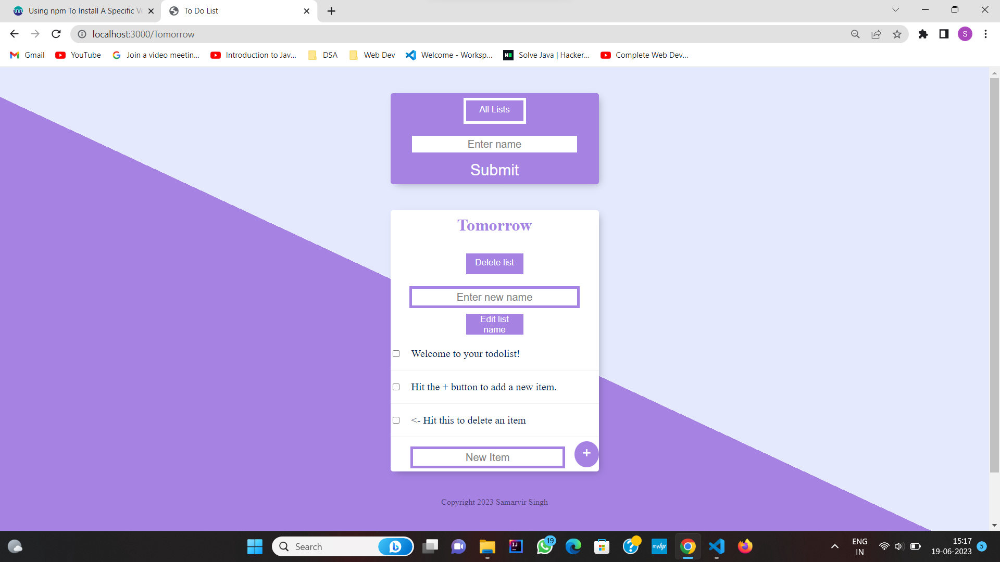
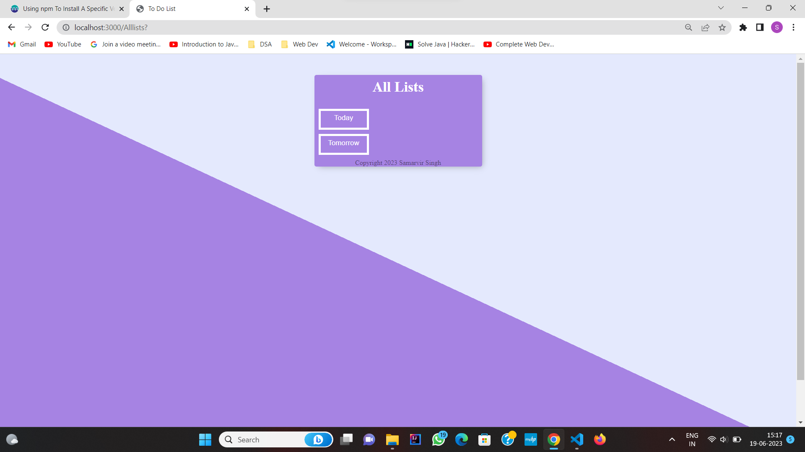
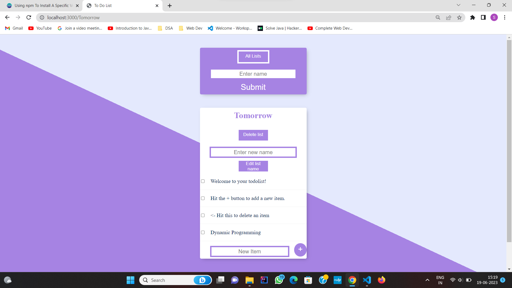

# ToDoList
It allows you to create different lists of work so that you don’t need to remember the tasks that need to be done. It allows to add new listd , delete existing lists , change lists’ name and and add tasks into lists as well as delete them.
## Screenshots

